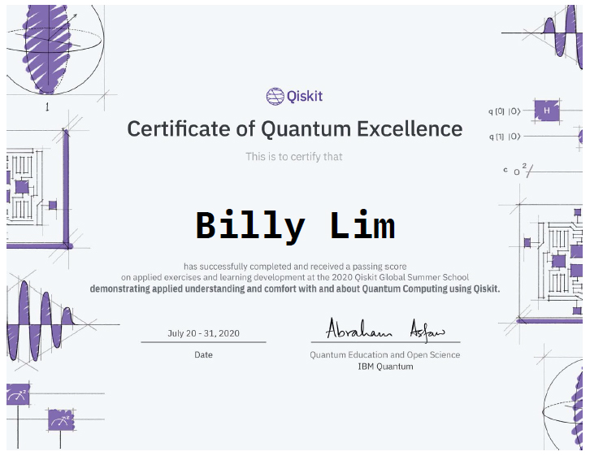

# Qiskit Global Summer School 2020

These are the labs I did as part of the [Qiskit Global Summer School (QGSS)](https://qiskit.org/events/summer-school/)
All the teaching material used is now available as a [Qiskit Course](https://qiskit.org/learn/intro-qc-qh/)

## Summer School Details
__Site:__ [Qiskit](https://qiskit.org/events/summer-school/)  
__Date:__ July 2020  

## Certificate
  

## Description
The labs are contained in `ex1.ipynb` in each folder.  
Each `ipynb` is self-contained, with the exercise portion usually at the end.  
The notebooks are also saved as html for easier reference.  
Other files in the folders include images and grading tools as given by Qiskit.  